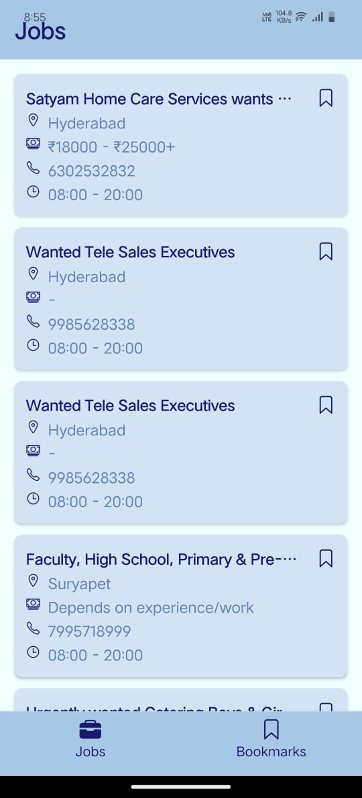
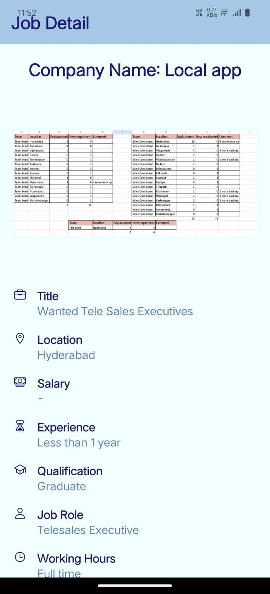
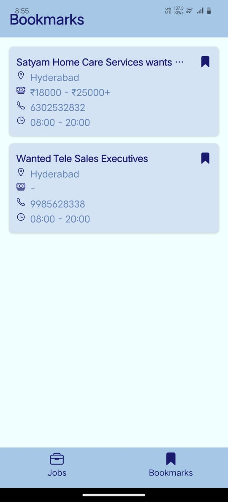

# React Native Job Portal App

This is a job listing and bookmarking app built using **React Native** and **Expo**. The app fetches job data from a remote API, allows users to bookmark jobs, and stores bookmarked jobs offline for later viewing.

## Features

- **Jobs Screen**: Fetches job data from the given API and displays a list of jobs with title, location, salary, and phone number.
- **Job Detail Screen**: Clicking on a job card opens a detailed view with more information about the job.
- **Bookmarking**: Users can bookmark jobs, which will appear in the **Bookmarks** tab.
- **Offline Storage**: All bookmarked jobs are stored in a local database for offline viewing.
- **Infinite Scrolling**: The Jobs screen fetches more jobs as the user scrolls down.
- **Loading & Error States**: The app maintains loading, error, and empty states throughout the user experience.

---


## Installation

To run this app locally, follow the steps below:

### Prerequisites

Make sure you have the following installed:

- [Node.js](https://nodejs.org/)
- [Expo CLI](https://docs.expo.dev/get-started/installation/) (for development)
- Android Studio / Xcode (for building and running on Android or iOS)

### Steps to Install

1. **Clone the Repository**:

   ```bash
   git clone https://github.com/IshikaNimade/LokalAssignment.git
   ```

2. **Navigate to the Project Directory**:

   ```bash
   cd LokalAssisment
   ```

3. **Install Dependencies**:

   ```bash
   npm install
   ```

   or

   ```bash
   yarn install
   ```

4. **Run the Application**:

   - For Android:

     ```bash
     npm run android
     ```

   - For iOS:

     ```bash
     npm run ios
     ```

   - If you are using Expo:

     ```bash
     expo start
     ```

---

## File Structure

```bash
LokalAssisment/
├── src/      
│   ├── assets/                        
│   ├── components/                 
│   │   └── JobCard.tsx
│   │   └── JobInfo.tsx
│   │   └── IconButton.tsx
│   │   └── EmptyState.tsx
│   ├── constants/                 
│   │   └── styles.ts
│   │   └── theme.ts
│   ├── context/  
│   │   └── JobContext.tsx          
│   ├── hooks/                     
│   │   └── useJob.ts
│   ├── navigation/                 
│   │   └── AppNavigator.tsx
│   ├── screens/                    
│   │   └── JobsScreen.tsx
│   │   └── JobDetailScreen.tsx
│   │   └── BookmarksScreen.tsx
│   ├── services/                  
│   │   └── api.ts
│   ├── types/                   
│   │   └── job.ts
│   │   └── navigation.ts
│   └── utils/                      
│       └── storage.ts
├── App.tsx                         
├── app.json                        
├── package.json                    
└── README.md                       
```

---

## How the App Works

### **Jobs Screen**

- The app fetches a list of jobs from the API (`https://testapi.getlokalapp.com/common/jobs?page=1`).
- Displays a list of job cards showing the **title**, **location**, **salary**,**phone number** and **prefered time**.
- Infinite scroll is implemented, meaning more jobs will load as the user scrolls down.
- Users can click on any job card to view detailed information about the job.



### **Job Detail Screen**

- When a user clicks on a job card, they are navigated to a Job Detail screen.
- The screen displays additional job details like company name, image,Title, Location, Salary, qualifications, experience,Job role, Working hours and contact preferences (WhatsApp and phone).
- Users can contact the employer via WhatsApp or call directly from this screen.
- Users can also bookmark the job for later view.



### **Bookmarks Screen**

- The Bookmarks screen shows all jobs the user has bookmarked.
- Users can easily remove bookmarks and see a list of jobs they've saved for later.



### **Bookmarking Jobs**

- Jobs can be bookmarked by pressing the bookmark button on the job detail screen and job card.
- Bookmarked jobs are stored offline and can be accessed even when the user is not connected to the internet.

---

## Offline Storage

This app uses **@react-native-async-storage/async-storage** to persist bookmarked jobs locally. This ensures:

- Users can view their bookmarked jobs even when offline.

- Bookmarks are saved across app restarts.

- Bookmarked data is retrieved and synced with state on app launch.

```bash
npm install @react-native-async-storage/async-storage
# or
yarn add @react-native-async-storage/async-storage
```
---

## Handling Loading, Error, and Empty States

- **Loading State**: While fetching data, a loading spinner is displayed to inform users that data is being loaded.
- **Error State**: If there’s an error fetching the data, an error message is displayed to the user.
- **Empty State**: If there are no jobs to display (e.g., if the API returns no data), an empty message is shown.

---

## Libraries Used

- **React Native**: Core framework for building the app.
- **Expo**: Provides tools and services to make app development easier.
- **React Navigation**: Manages navigation between screens.
- **Axios**: Used to fetch data from the API.
- **AsyncStorage**: For storing bookmarked jobs locally.
- **Ionicons**: For icons throughout the app.

---
